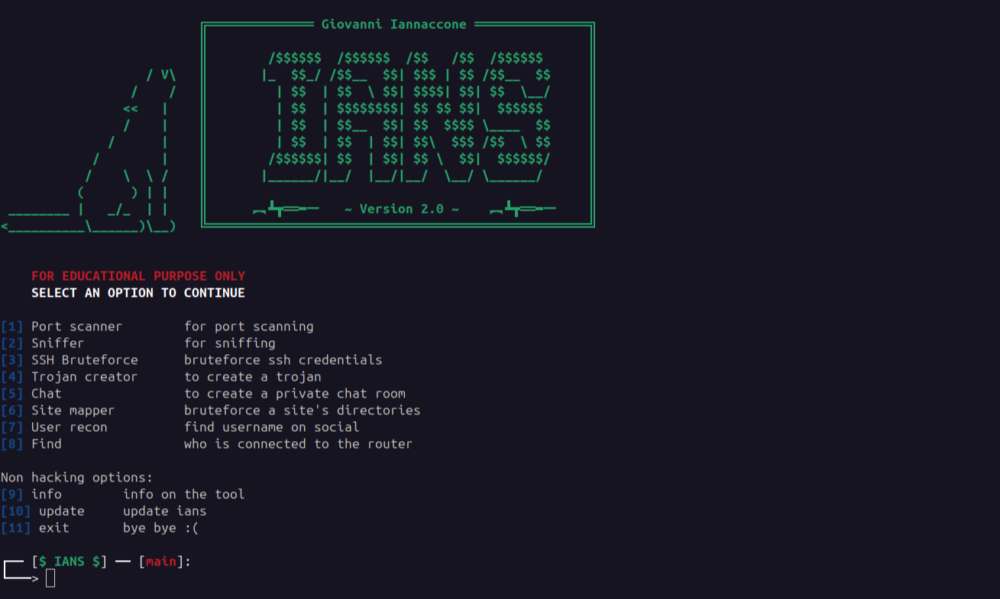
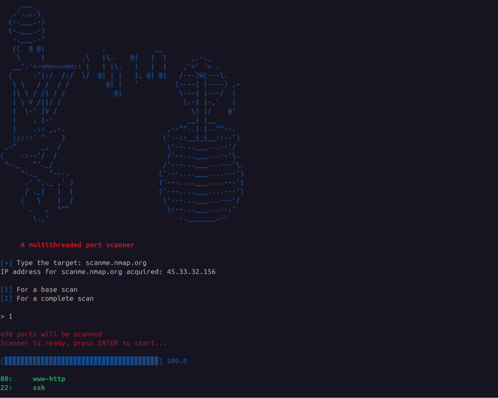
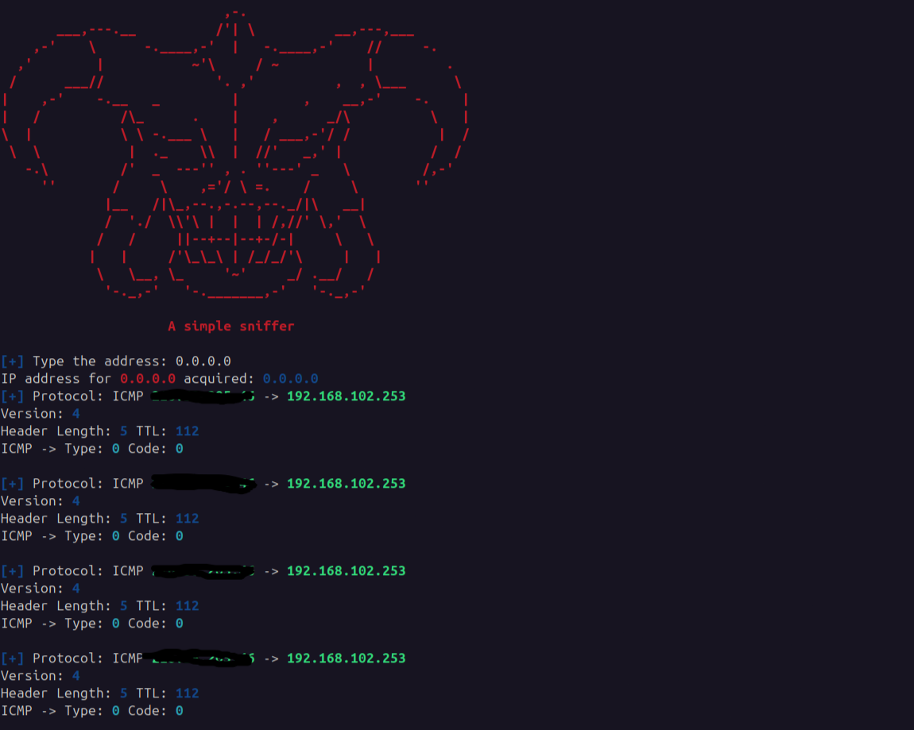
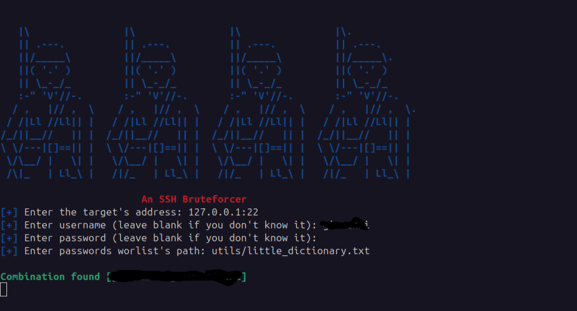
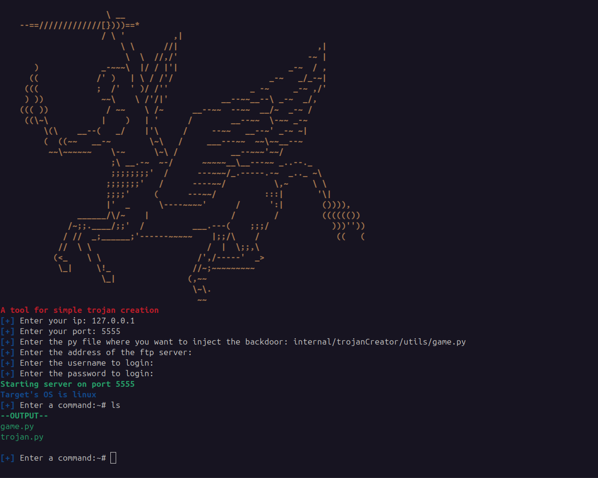
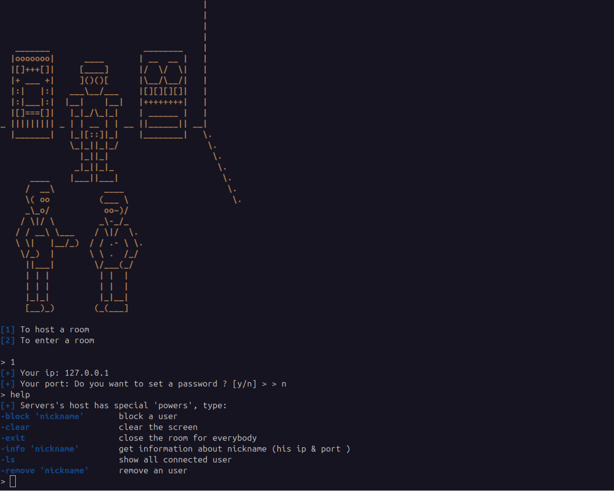
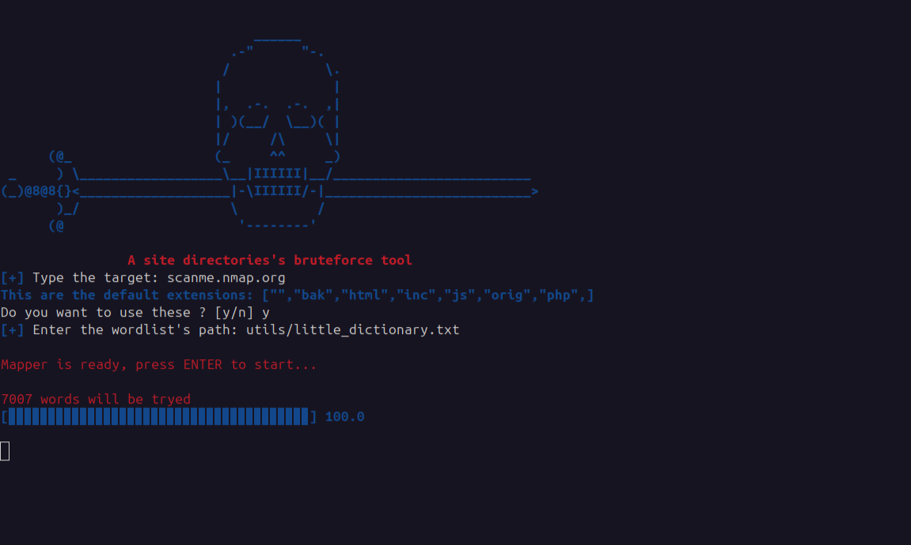
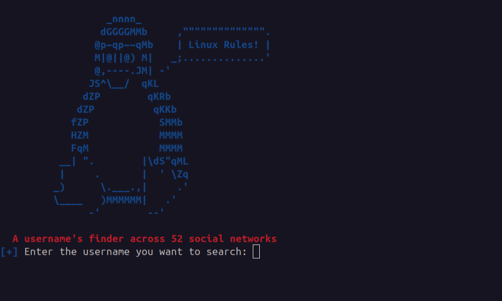

# 🐉 ians
ians is the "swiss army knife" of hacking, perfect for a variety of tactical operations

## 📚 Features
- Variety of attacks
    - port scan
    - sniffer
    - ssh bruteforce
    - create trojan
    - private chatroom
    - map a site
    - find connected people
    - user recon
- Fast and lightweight
- Dependency-light

## 🪢 Installation

### 🧮 Prerequisites
- golang: <a href="https://go.dev/doc/install">install go</a>
- python: <a href="https://www.python.org/downloads/">install python</a>

### 🪄 Installation Steps
1. Clone the repository:
   ```
   git clone https://github.com/giovanni-iannaccone/ians
   cd ians
   ```
2. Run installation script:
   ```
   chmod +x install.sh
   ./install.sh
   ```
3. Execute ians:
   ```
   go run ians.go
   ```
   or build it:

   ```
   go build ians.go
   ```

> [!CAUTION]
> The ians team does not assume any responsibility for the improper use of the app.

## 🎮 Usage
Write the number corrisponding to the attack you want to run
 </img>

1. the port scanner
Type target's ip or hostname, select the type of scan and press enter
 </img>

2. sniffer
Every captured packet will be printed in a decoded format
 </img>

3. ssh bruteforce
Enter username (or a wordlist), password (or a wordlist), press enter and wait
 </img>

4. trojan creator
Type your ip and port, file to infect's path and your ftp credentials (optional). </br>
Send the trojan to your victim and wait for him to execute it.
 </img>

5. chatroom
Host a chatroom or connect to an existing one. If you connect send messages to other users, </br>
if you are hosting, manage your room by setting a password, removing and blocking users.
 </img>

6. site mapper
Enter site's url, file extensions (optional) and a wordlist path, press enter and wait
 </img>

7. user recon
Type a username and search it across many social media
 </img>

## 🧩 Contributing
We welcome contributions! Please follow these steps:

1. Fork the repository.
2. Create a new branch ( using <a href="https://medium.com/@abhay.pixolo/naming-conventions-for-git-branches-a-cheatsheet-8549feca2534">this</a> convention).
3. Make your changes and commit them with descriptive messages.
4. Push your changes to your fork.
5. Create a pull request to the main repository.

## 🔭 Learn
Golang: https://go.dev/doc/ </br>
Hacking: https://tryhackme.com/

## ⚖ License
This project is licensed under the GPL-3.0 License. See the LICENSE file for details.

## ⚔ Contact
- For any inquiries or support, please contact <a href="mailto:iannacconegiovanni444@gmail.com"> iannacconegiovanni444@gmail.com </a>.
- Visit my site for more informations about me and my work <a href="https://giovanni-iannaccone.gith
ub.io" target=”_blank” rel="noopener noreferrer"> https://giovanni-iannaccone.github.io </a>